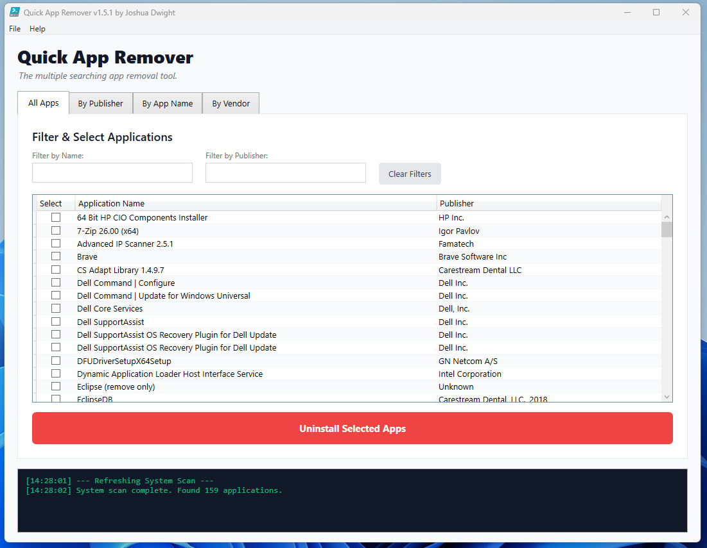
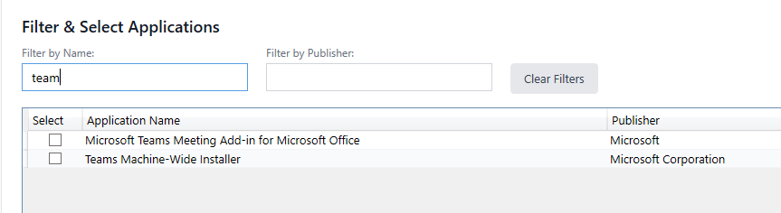
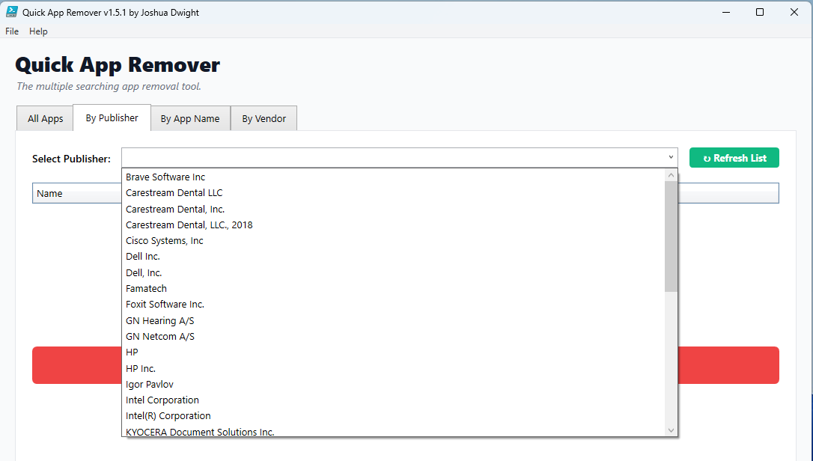
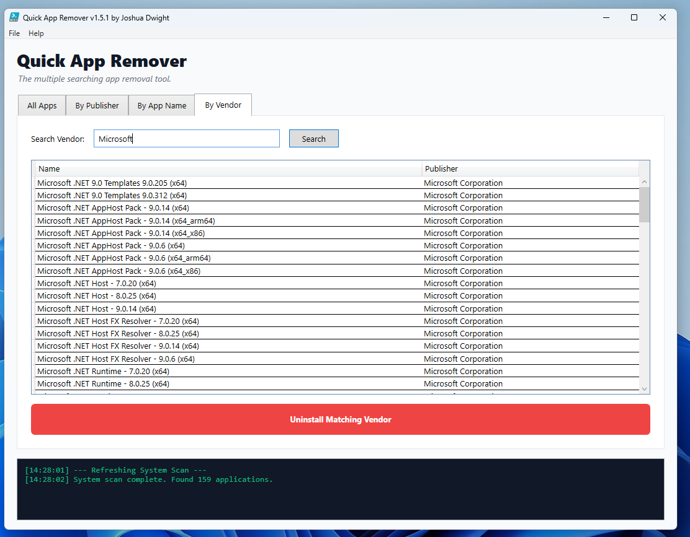

Quick App Remover 🚀
"The multiple searching app removal tool."

Quick App Remover is a high-performance, PowerShell-based utility designed for system administrators and power users who need to perform bulk software uninstallation without the sluggishness and risks associated with standard Windows tools.

Unlike traditional scripts that rely on WMIC or Win32_Product (which can trigger slow consistency checks and forced reboots), Quick App Remover utilizes an embedded C# discovery engine to scan the Windows Registry directly. This results in near-instantaneous application indexing.

✨ Key Features

Lightning-Fast Discovery: Uses inline C# to bypass WMI, scanning thousands of registry keys in milliseconds.

Removal By Application Name

Persistent Multi-Search: The unique "Search & Select" workflow allows you to filter for one keyword (e.g., "Java"), check the boxes, filter for another (e.g., "Adobe"), and keep all previous selections active.

Removal by Publisher (Auto Populated)
Quick App Remover has the ability to list your applications by Publisher for quick and easy removal

Removal by Vendor Search (Utilizes Wildcards automatically)
Vendor searching allows you to search by vendor name and remove multiple apps quickly without you needing to worry about utilizing wildcards at all because they are utilized automatically for you. Just search the vendor name and uninstall results at the click of a button.

Sequential Silent Uninstallation: Automatically injects silent/quiet flags into uninstallation strings to ensure a hands-off experience.

Power User Shortcuts:

Ctrl + A: Select all rows in the current view.

Ctrl + 1, 2, 3, 4: Quick tab switching.

Enter: Instant search from any text field.

Bulk Toggle: Highlight multiple rows and click a single checkbox to toggle the entire selection.

Robust Error Handling: Designed to survive "Type already exists" errors and property binding issues common in PowerShell GUI development.

🛠 Usage Guide

Installation & Execution

Download the QuickAppRemover.ps1 file.

Right-click the file and select Run with PowerShell.

Important: Administrative privileges are required to trigger uninstalls. If prompted, allow the script to run as Administrator.

The "All Apps" Workflow (Recommended)

Navigate to the All Apps tab (Ctrl+1).

Use the Filter by Name or Filter by Publisher boxes to find specific software.

Check the apps you want to remove.

Change your search text to find more apps; your previous checkmarks will stay "stuck."

Click Uninstall Selected Apps to begin the sequential removal process.

📋 System Requirements

OS: Windows 10 / 11 / Windows Server 2016+

PowerShell: 5.1 or Core (Run as Administrator)

Framework: .NET Framework 4.5+ (for WPF and C# compilation)

📜 Changelog Summary

v1.5.1: Integrated official slogan and UI polish.

v1.5.0: Added User Guide and About sections.

v1.4.x: Refined selection logic using PowerShell NoteProperties to fix binder errors; added global Menu Bar.

v1.3.x: Introduced real-time "filter-as-you-type" and selection persistence.

v1.0.0: Initial build with C# registry engine.

👤 Author

Joshua Dwight GitHub Profile

📄 License

This project is licensed under the MIT License - feel free to use and modify it for your own administrative tasks!
